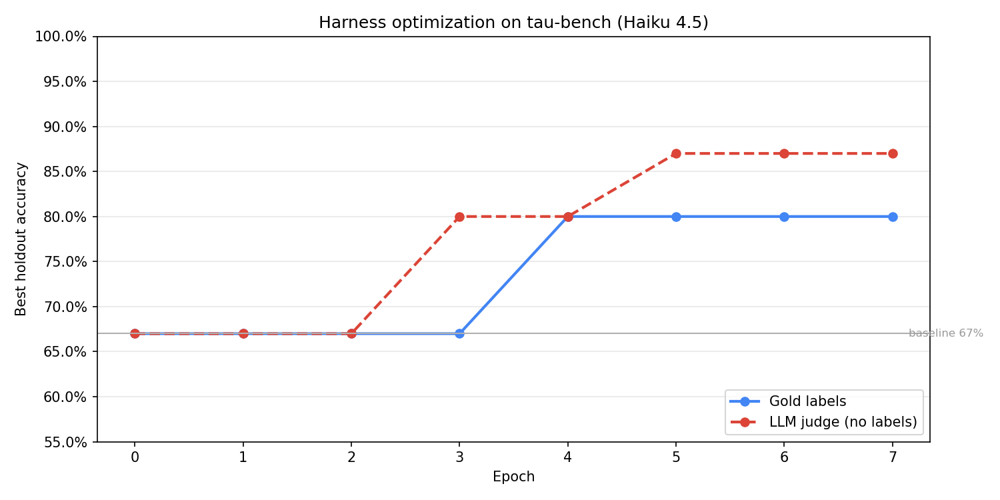

# meta-agent

Automatic harness optimization for AI agents. 67% → 87% on [tau-bench](https://github.com/sierra-research/tau-bench) with no labels. See [WRITEUP.md](WRITEUP.md) for full results.



## Prerequisites

- Python 3.11+
- [Claude Code CLI](https://docs.anthropic.com/en/docs/claude-code)
- `ANTHROPIC_API_KEY`
- `OPENAI_API_KEY` (optional, for LLM judge)

## Quick start

```bash
git clone https://github.com/canvas-org/meta-agent
cd meta-agent
pip install -e .
cp .env.example .env   # set ANTHROPIC_API_KEY
source .env

# Run a baseline eval
python -m meta_agent.eval_runner \
    --benchmark benchmarks/example/benchmark.yaml \
    --config configs/vanilla.py \
    --name baseline \
    --model claude-haiku-4-5

# Run the optimization loop
python -m meta_agent.outer_loop \
    --benchmark benchmarks/example/benchmark.yaml \
    --iterations 5 \
    --model claude-haiku-4-5
```

## Optimize your own harness

### 1. Define tasks

```yaml
name: my-app
tasks:
  - name: resolve-billing
    instruction: "Customer was double-charged. Look up their account and resolve it."
    workspace: ./workspaces/billing
    verify: ["python", "check.py"]
```

| Field         | Description                              |
| ------------- | ---------------------------------------- |
| `instruction` | Prompt given to the agent                |
| `workspace`   | Directory with files the agent needs     |
| `verify`      | Command to check success (exit 0 = pass) |
| `setup`       | Optional pre-run command                 |
| `timeout`     | Kill after N seconds (default: 300)      |

### 2. Write a baseline config

A config is a Python file exporting `build_options(ctx) -> ClaudeAgentOptions`:

```python
from claude_agent_sdk import ClaudeAgentOptions
from meta_agent.run_context import RunContext

def build_options(ctx: RunContext) -> ClaudeAgentOptions:
    return ClaudeAgentOptions(
        system_prompt={"type": "preset", "preset": "claude_code"},
        cwd=ctx.cwd,
        model=ctx.model,
        permission_mode="bypassPermissions",
        max_turns=200,
        thinking={"type": "adaptive"},
    )
```

Start from `configs/vanilla.py` or bring your own. See `SKILL.md` for the full SDK reference.

### 3. Run

```bash
# Baseline
python -m meta_agent.eval_runner \
    --benchmark path/to/benchmark.yaml \
    --config path/to/my_config.py \
    --name baseline \
    --model claude-haiku-4-5

# Optimize (--proposer-model is the model that reads traces and writes configs)
python -m meta_agent.outer_loop \
    --benchmark path/to/benchmark.yaml \
    --iterations 10 \
    --model claude-haiku-4-5 \
    --proposer-model claude-opus-4-6
```

Results go to `experience/<benchmark>/candidates/`.

## Reproducing tau-bench results

```bash
pip install "tau2 @ git+https://github.com/sierra-research/tau2-bench.git"

python -m meta_agent.outer_loop \
    --benchmark benchmarks/tau3/benchmark.yaml \
    --holdout-benchmark benchmarks/tau3/benchmark_holdout.yaml \
    --iterations 10 \
    --model claude-haiku-4-5 \
    --proposer-model claude-opus-4-6
```

## Project structure

```
meta_agent/                # Framework (outer loop, eval, task runner, CLI)
configs/                   # Starter harness configs (vanilla, bootstrap, hooks)
benchmarks/
├── example/               # Local demo (fibonacci + calculator)
└── tau3/                  # tau-bench v3 (airline, retail)
images/                    # Figures
SKILL.md                   # Proposer instructions
WRITEUP.md                 # Results and methodology
```

## License

MIT
